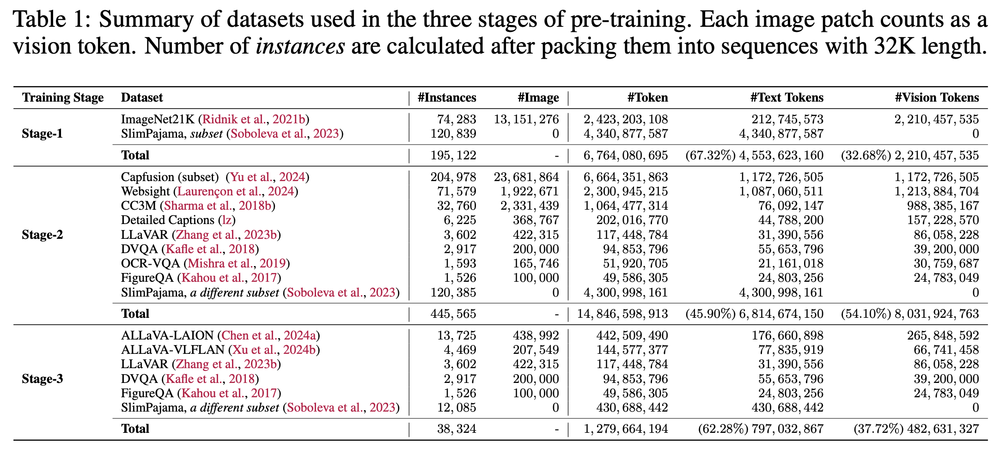

<h1 align="center"> SOLO: A Single Transformer for Scalable &nbsp;&nbsp;&nbsp;&nbsp;&nbsp;&nbsp;Vision-Language Modeling </h1>

<p align="center">
<a href="https://arxiv.org/abs/TODO">📃 Paper</a>
•
<a href="https://huggingface.co/YangyiYY/SOLO-7B" >🤗 Model (SOLO-7B)</a>
</p>


We present **SOLO**, a **single Transformer architecture for unified vision-language modeling**.
SOLO accepts both raw image patches (in *pixels*) and texts as inputs, *without* using a separate pre-trained vision encoder.


## TODO Roadmap
  
- [ ] **Release the code for instruction tuning**

- [ ] **Release the instruction tuning data mixture**

&nbsp; ✅ **Release the [pre-training code](https://github.com/Yangyi-Chen/SOLO/blob/main/PRETRAIN_GUIDE.md)**

&nbsp; ✅ **Release the SOLO model** <a href="https://huggingface.co/YangyiYY/SOLO-7B" >🤗 Model (SOLO-7B)</a>

&nbsp; ✅ **Paper on arxiv** <a href="https://arxiv.org/abs/TODO">📃 Paper</a>


## Setup

### Clone Repo

```bash
git clone https://github.com/Yangyi-Chen/SOLO
git submodule update --init --recursive
```

### Setup Environment for Data Processing

```bash
conda env create -f environment.yml
conda activate solo
```

OR simply

```bash
pip install -r requirements.txt
```

## SOLO Inference with Huggingface

Check [`scripts/notebook/demo.ipynb`](scripts/notebook/demo.ipynb) for an example of performing inference on the model.


## Pre-Training

Please refer to [PRETRAIN_GUIDE.md](PRETRAIN_GUIDE.md) for more details about how to perform pre-training. The following table documents the data statistics in pre-training:



## Citation
If you use or extend our work, please consider citing our paper.
<!---
```bibtex
@article{chen2024solo,
      title={A Single Transformer for Scalable Vision-Language Modeling}, 
      author={Chen, Yangyi and Wang, Xingyao and Peng, Hao and Ji, Heng},
      journal={arXiv preprint arXiv:2405.20974},
      year={2024}
}
```
-->
