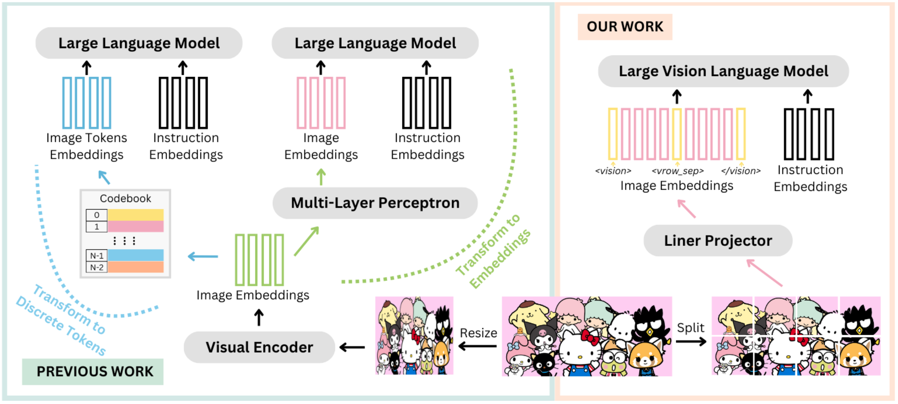

<h1 align="center"> SOLO: A Single Transformer for Scalable Vision-Language Modeling </h1>

<p align="center">
<a href="https://arxiv.org/abs/TODO">📃 Paper</a>
•
<a href="https://huggingface.co/xingyaoww/SOLO-7B" >🤗 Model (SOLO-7B)</a>
</p>



We present **SOLO**, a **single Transformer architecture for unified and end-to-end vision-language modeling**.
SOLO accepts both raw image patches (in *pixels*) and texts as inputs, *without* using a separate pre-trained vision encoder.

## Setup

### Clone Repo

```bash
git clone https://github.com/Yangyi-Chen/SOLO
git submodule update --init --recursive
```

### Setup Environment for Data Processing

```bash
conda env create -f environment.yml
conda activate solo
```

OR simply

```bash
pip install -r requirements.txt
```

## Inference SOLO with huggingface transformers

Check [`scripts/notebook/demo.ipynb`](scripts/notebook/demo.ipynb) for an example of performing inference on the model.


## Training

Please refer to [PRETRAIN_GUIDE.md](PRETRAIN_GUIDE.md) for more details about how to perform pre-training.

## Citations

```bibtex
TODO
```
